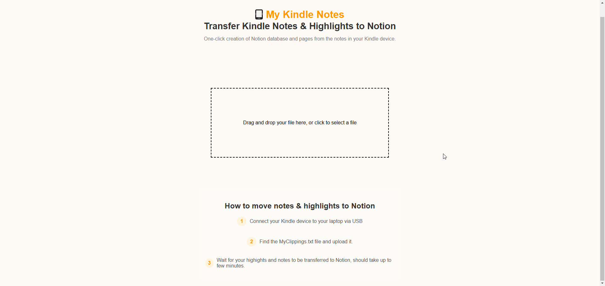

# Kindle to Notion Notes Transfer



A web application to transfer Kindle notes and highlights from the `My Clippings.txt` file into Notion as well-organized pages.

## Features

- Simple drag-and-drop upload for `My Clippings.txt`.
- Automatically creates Notion pages and databases from your Kindle highlights.
- Quick and easy-to-use interface.

## How to Use

1. **Export Kindle Notes**:
   - Connect your Kindle to your computer via USB.
   - Locate the `My Clippings.txt` file on your Kindle.

2. **Transfer to Notion**:
   - Drag and drop the `My Clippings.txt` file into the upload box on the app.
   - Wait for the transfer process to complete.

## How to Run the Application Locally

1. Clone this repository:
   ```bash
   git clone <repository-url>
   cd <repository-folder>
   ```

2. Install dependencies:
   ```bash
   git clone <repository-url>
   cd <repository-folder>
   ```

3. Start the application:
   ```bash
   node server.js
   ```